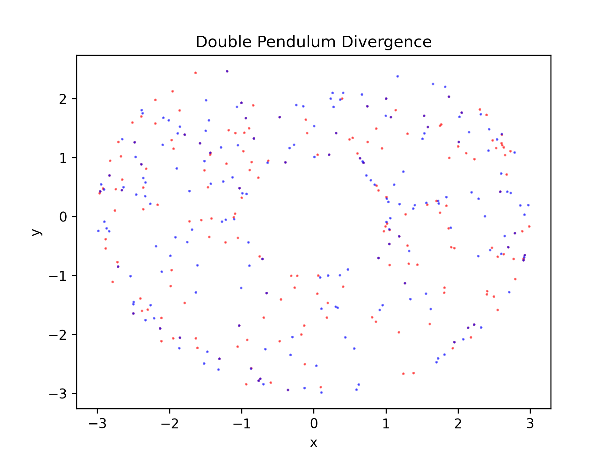

# Double Pendulum

## Simulation

Build the simulation program:

```sh
make
```

The compiled binary is written to `./build/double-pendulum`.

Both double pendulum system and simulation are configured via environment
variables.

| Variable         | Description                     | Value    | Default |
| ---------------- | ------------------------------- | -------- | ------- |
| `DP_SYSTEM_M1`   | Mass of the first weight        | _double_ | 3       |
| `DP_SYSTEM_M2`   | Mass of the second weight       | _double_ | 3       |
| `DP_SYSTEM_L1`   | Length of the first rod         | _double_ | 2       |
| `DP_SYSTEM_L2`   | Length of the second rod        | _double_ | 1       |
| `DP_SYSTEM_PHI1` | Initial angle of the first rod  | _double_ | π       |
| `DP_SYSTEM_PHI2` | Initial angle of the second rod | _double_ | π/2     |
| `DP_SYSTEM_G`    | Gravitational acceleration      | _double_ | 9.81    |
| `DP_SYSTEM_DT`   | Time delta in seconds           | _double_ | 0.0001  |

| Variable               | Description            | Value                              | Default |
| ---------------------- | ---------------------- | ---------------------------------- | ------- |
| `DP_SIMULATION_STEPS`  | Number of steps        | _non-negative int_                 | 1000000 |
| `DP_SIMULATION_METHOD` | ODE computation method | "ralston", "RK4", "RK3/8", "DOPRI" | "RK4"   |
| `DP_SIMULATION_OUTPUT` | Output CSV file        | _path_ or "-" for stdout           | "-"     |

The resulting CSV file contains a total of `DP_SIMULATION_STEPS` rows with
coordinates of weights (`x1,y1,x2,y2`). `DP_SYSTEM_DT` is the timespan between
rows.


## Chaos plot

> [!note]
> Chaos plot requires [uv](https://docs.astral.sh/uv/) to be installed.

Chaos plot demonstrates how two systems with nearly identical settings diverge
over time. It consists of coordinate points of the second weight.



```sh
# Generate two sets of coordinates with slightly different system conditions.
DP_SYSTEM_PHI1=3.14159265358979323846 DP_SIMULATION_OUTPUT=1.csv ./build/double-pendulum
DP_SYSTEM_PHI1=3.141592653589 DP_SIMULATION_OUTPUT=2.csv ./build/double-pendulum

# Generate chaos plot.
# uv run ./graphics/chaos_plot.py [csv 1] [csv 2] [csv 3] [...]
uv run ./graphics/chaos_plot.py 1.csv 2.csv
```

The following environment variables are used for configuration.

| Variable             | Description                                      | Value                    | Default                 |
| -------------------- | ------------------------------------------------ | ------------------------ | ----------------------- |
| `DP_CHAOS_FRAMERATE` | Number of frames per second sampled for plotting | _int_                    | 2                       |
| `DP_CHAOS_COLORS`    | Which colors to use for coordinates points       | _comma-separated colors_ | "red,blue,green,orange" |
| `DP_CHAOS_OUTPUT`    | Output image file                                | _path_                   | chaos.png               |

In addition, `DP_SYSTEM_DT` is used with `DP_CHAOS_FRAMERATE` to sample
coordinates for plotting.


## Animation

> [!note]
> Animation requires [uv](https://docs.astral.sh/uv/) to be installed.

[Manim](https://www.manim.community/) animation of the double pendulum system.

```sh
DP_ANIMATION_DATASET=data.csv uv run manim -qh ./graphics/animation.py DoublePendulum
```

Environment variables are as follows.

| Variable                 | Description                                           | Value   | Default |
| ------------------------ | ----------------------------------------------------- | ------- | ------- |
| `DP_ANIMATION_FRAMERATE` | Frame rate of the animation                           | _int_   | 24      |
| `DP_ANIMATION_DATASET`   | CSV file to animate data from                         | _path_  | —       |
| `DP_ANIMATION_TRAIL`     | Duration of the trail of the second weight in seconds | _float_ | 0.5     |

Similar to chaos plot, `DP_SYSTEM_DT` is used with `DP_ANIMATION_FRAMERATE` for
sampling of coordinates.

Radius of the weight points are controlled by `DP_SYSTEM_M1` and `DP_SYSTEM_M2`
env variables (`DEFAULT_DOT_RADIUS` constant is used by default).
