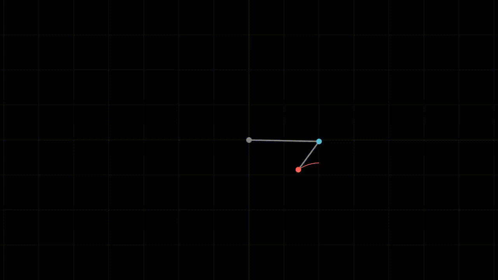

# Double Pendulum

Simulation of [Double pendulum](https://en.wikipedia.org/wiki/Double_pendulum)
with configurable parameters.



## Simulation

Build the simulation program:

```sh
make
```

The compiled binary is written to `./build/double-pendulum`.

Both double pendulum system and simulation are configured via environment
variables.

| Variable                   | Description                                | Value    | Default |
| -------------------------- | ------------------------------------------ | -------- | ------- |
| `DP_SYSTEM_M1`             | Mass of the first weight                   | _double_ | 3       |
| `DP_SYSTEM_M2`             | Mass of the second weight                  | _double_ | 3       |
| `DP_SYSTEM_L1`             | Length of the first rod                    | _double_ | 2       |
| `DP_SYSTEM_L2`             | Length of the second rod                   | _double_ | 1       |
| `DP_SYSTEM_PHI1`           | Initial angle of the first rod             | _double_ | π       |
| `DP_SYSTEM_PHI2`           | Initial angle of the second rod            | _double_ | π/2     |
| `DP_SYSTEM_G`              | Gravitational acceleration                 | _double_ | 9.81    |
| `DP_SYSTEM_DT`             | Time delta in seconds                      | _double_ | 1e-4    |
| `DP_SYSTEM_DT_MIN`         | Min time delta for embedded methods        | _double_ | 1e-4    |
| `DP_SYSTEM_DT_MAX`         | Max time delta for embedded methods        | _double_ | 1e-4    |
| `DP_SYSTEM_ATOL_PHI1`      | Absolute tolerance of the first angle      | _double_ | 1e-6    |
| `DP_SYSTEM_RTOL_PHI1`      | Relative tolerance of the first angle      | _double_ | 1e-4    |
| `DP_SYSTEM_ATOL_PHI2`      | A. tol. of the second angle                | _double_ | 1e-6    |
| `DP_SYSTEM_RTOL_PHI2`      | R. tol. of the second angle                | _double_ | 1e-4    |
| `DP_SYSTEM_ATOL_OMEGA1`    | A. tol. of the first angular velocity      | _double_ | 1e-6    |
| `DP_SYSTEM_RTOL_OMEGA1`    | R. tol. of the first angular velocity      | _double_ | 1e-4    |
| `DP_SYSTEM_ATOL_OMEGA2`    | A. tol. of the second angular velocity     | _double_ | 1e-6    |
| `DP_SYSTEM_RTOL_OMEGA2`    | R. tol. of the second angular velocity     | _double_ | 1e-4    |
| `DP_SYSTEM_ERR_MIN_FACTOR` | Min dt scaling factor for embedded methods | _double_ | 0.25    |
| `DP_SYSTEM_ERR_MAX_FACTOR` | Max dt scaling factor for embedded methods | _double_ | 4.0     |

| Variable                 | Description                    | Value                                          | Default |
| ------------------------ | ------------------------------ | ---------------------------------------------- | ------- |
| `DP_SIMULATION_DURATION` | Simulation duration in seconds | _double_                                       | 30      |
| `DP_SIMULATION_METHOD`   | ODE computation method         | "ralston", "RK4", "RK3/8", "DOPRI5", "DOPRI8"  | "RK4"   |
| `DP_SIMULATION_OUTPUT`   | Output CSV file                | _path_ or "-" for stdout                       | "-"     |

The resulting CSV file contains rows with coordinates of weights
(`x1,y1,x2,y2`).

For explicit Runge-Kutta methods (`ralston`, `RK4`, `RK3/8`) the timespan
between rows is `DP_SYSTEM_DT`, for embedded (`DOPRI5`, `DOPRI8`) it is scaled
after each step, based on computation error and system parameters. The scaling
factor is clamped between `DP_SYSTEM_ERR_MIN_FACTOR` and
`DP_SYSTEM_ERR_MAX_FACTOR`, and the time delta itself is clamped between
`DP_SYSTEM_DT_MIN` and `DP_SYSTEM_DT_MAX`.


## Chaos plot

> [!note]
> The graphics are generated using Python, managed with
> [uv](https://docs.astral.sh/uv/). Make sure it is installed and working.

Chaos plot demonstrates how two systems with nearly identical settings diverge
over time. It consists of coordinate points of the second weight.


```sh
# Generate two sets of coordinates with slightly different system conditions.
DP_SYSTEM_PHI1=3.14159265358979323846 DP_SIMULATION_OUTPUT=1.csv ./build/double-pendulum
DP_SYSTEM_PHI1=3.141592653589 DP_SIMULATION_OUTPUT=2.csv ./build/double-pendulum

# Generate chaos plot.
# uv run ./graphics/chaos_plot.py [csv 1] [csv 2] [csv 3] [...]
uv run ./graphics/chaos_plot.py 1.csv 2.csv
```

The following environment variables are used for configuration.

| Variable             | Description                                      | Value                    | Default                 |
| -------------------- | ------------------------------------------------ | ------------------------ | ----------------------- |
| `DP_CHAOS_FRAMERATE` | Number of frames per second sampled for plotting | _int_                    | 2                       |
| `DP_CHAOS_COLORS`    | Which colors to use for coordinates points       | _comma-separated colors_ | "red,blue,green,orange" |
| `DP_CHAOS_OUTPUT`    | Output image file                                | _path_                   | chaos.png               |

In addition, `DP_SYSTEM_DT` is used with `DP_CHAOS_FRAMERATE` to sample
coordinates for plotting.


## Animation

[Manim](https://www.manim.community/) animation of the double pendulum system.

```sh
DP_ANIMATION_DATASET=data.csv uv run manim -qh ./graphics/animation.py DoublePendulum
```

Environment variables are as follows.

| Variable                 | Description                                           | Value   | Default |
| ------------------------ | ----------------------------------------------------- | ------- | ------- |
| `DP_ANIMATION_FRAMERATE` | Frame rate of the animation                           | _int_   | 24      |
| `DP_ANIMATION_DATASET`   | CSV file to animate data from                         | _path_  | —       |
| `DP_ANIMATION_TRAIL`     | Duration of the trail of the second weight in seconds | _float_ | 0.5     |

Similar to chaos plot, `DP_SYSTEM_DT` is used with `DP_ANIMATION_FRAMERATE` for
sampling of coordinates.

Radius of the weight points are controlled by `DP_SYSTEM_M1` and `DP_SYSTEM_M2`
env variables (`DEFAULT_DOT_RADIUS` constant is used by default).

You can also overlay multiple animations with transparency using [ffmpeg](https://ffmpeg.org/):

```sh
DP_SIMULATION_DURATION=60 DP_SYSTEM_PHI1=3.14159265358979323846 DP_SIMULATION_OUTPUT=1.csv ./build/double-pendulum
DP_SIMULATION_DURATION=60 DP_SYSTEM_PHI1=3.141592653589 DP_SIMULATION_OUTPUT=2.csv ./build/double-pendulum

DP_ANIMATION_DATASET=1.csv uv run manim -o 1.mp4 -qh ./graphics/animation.py DoublePendulum
DP_ANIMATION_DATASET=2.csv uv run manim -o 2.mp4 -qh ./graphics/animation.py DoublePendulum

# Overlay multiple videos using transparency filter.
# Adjust the scale as needed.
ffmpeg \
    -i ./media/videos/animation/1080p24/1.mp4 -i ./media/videos/animation/1080p24/2.mp4 \
    -filter_complex " \
        [0:v]setpts=PTS-STARTPTS, scale=1920x1080[top]; \
        [1:v]setpts=PTS-STARTPTS, scale=1920x1080, \
             format=yuva420p,colorchannelmixer=aa=0.5[bottom]; \
        [top][bottom]overlay=shortest=1" \
    -acodec libvo_aacenc -vcodec libx264 out.mp4
```
